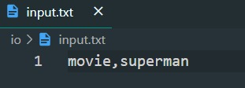

# Movie Recommendator using Airflow and Docker

## Project Descriptions
We take a movie or series title from the user and make recommendations of similar titles. I used regex to filter dataframes and
an API to get the movie recommendations. I used Airflow to schedule the tasks and Docker to run the project.

Each minute, the ETL looks into io/input.txt, extracts the movie or series written by the user and makes a recommendation of the 10 similar
titles in the io/output.txt file.

## Input Format
    <movie||series>,<title>

## To Run
    > docker-compose up